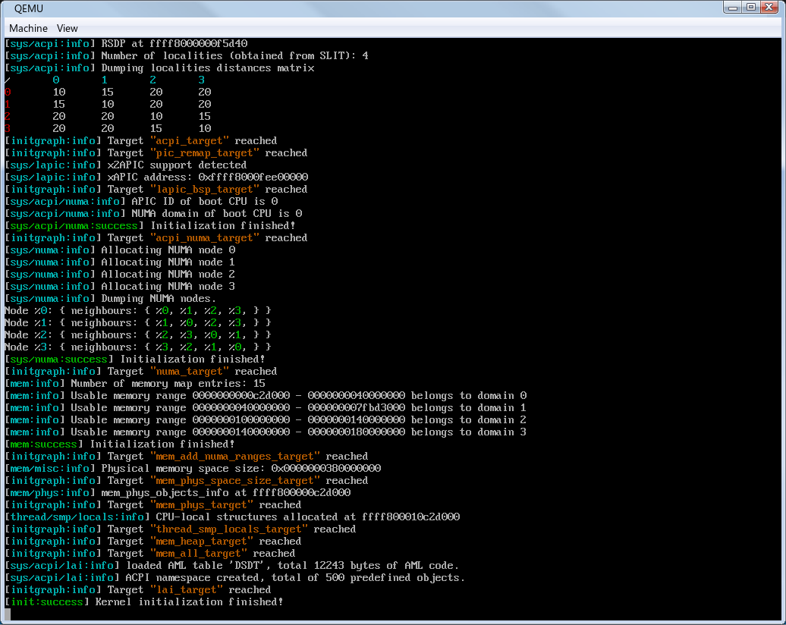
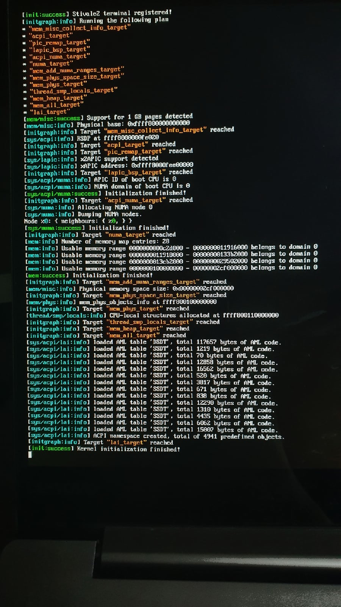

# Ricerca



lezione-os fork that I am using as a playground to experiment with SMP, NUMA and load balancing

# Nightly images

If you don't want to build ricerca, you can download latest images from nightly tag. Those are built on CI after every commit.

# Building

Install `python3`, `rsync`, `qemu-system`, `xorriso`, `fasm` and `build-essential` packages.

On systems with `apt` installed

```bash
sudo apt update
sudo apt install rsync qemu-system xorriso fasm build-essential
```

Install xbstrap from pip: `pip3 install xbstrap`.

Run `make build-release`/`make build-debug` in root directory to build release image (OS image with kernel built in release mode) and image for debugging respectively.

# Running

Run `make run-release-kvm` to run release image in QEMU with KVM enabled. If KVM is not available, you can use `make run-release-tcg` command.

Run `make run-safe-kvm` to run safe image (equivalent to the release image, but assertions are enabled) in QEMU with KVM enabled. If KVM is not available, you can use `make run-safe-tcg` command.

Run `make debug` to run debug image in QEMU. QEMU will wait for debugger to be attached. Run `make gdb-attach` in a separate terminal to start GDB and attach it to QEMU

# Real hardware

While there is no apparent reason why ricerca could break your hardware, **there is no warranty (to the extent permitted by law). Run ricerca on any real hardware at entirely your own risk. If you decide to run ricerca on your PC and it breaks, it is solely your responsibility since you have been warned**.

Having said that, it is indeed possible to run ricerca on your PC. Just copy image to a USB stick. Thanks to limine, ricerca can run both on UEFI and legacy BIOS.

I recommend to burn `ricerca-safe.iso` since it has assertions enabled.

Here is the debug log printed on my laptop


